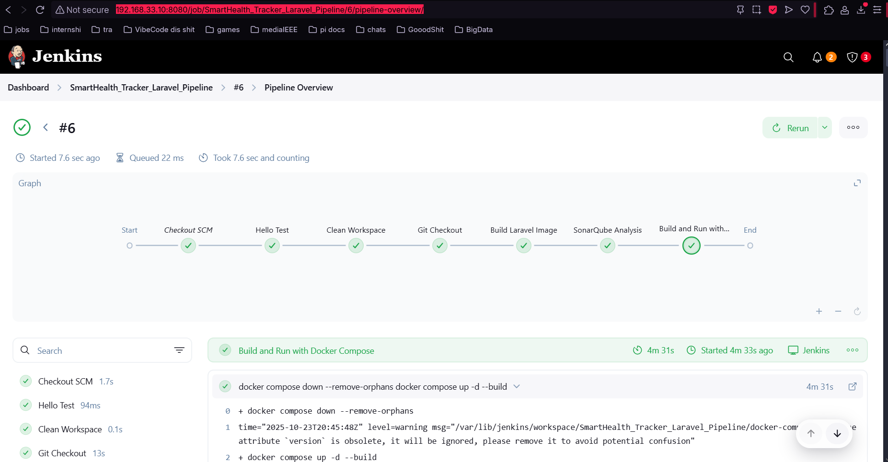

# Comprehensive CI/CD Pipeline Documentation

This markdown file details the end-to-end stages of the Jenkins pipeline for your Laravel project and includes placeholders for result screenshots. You can directly copy-paste this into your documentation and replace the placeholder images with your actual result files as needed.

---

## Pipeline Overview

graph TD
    A[Hello Test] --> B[Clean Workspace]
    B --> C[Git Checkout]
    C --> D[Build Laravel Image]
    D --> E[SonarQube Analysis]
    E --> F[Build & Run with Docker Compose]
    

---

## Stage Details

### 1. Hello Test

- **Purpose:**  
  Simple sanity check and greeting for pipeline verification.
- **Command executed:**  
  `echo 'Hi Jihed'`
- **Notes:**  
  Useful for logging initiation and testing of pipeline triggers.

---

### 2. Clean Workspace

- **Purpose:**  
  Ensures a clean build environment by deleting all files in the workspace.
- **Command executed:**  
  `deleteDir()`
- **Notes:**  
  Prevents errors due to leftover artifacts from previous builds.

---

### 3. Git Checkout

- **Purpose:**  
  Checks out the application source code from the designated development branch.
- **Branch:**  
  `devops`
- **Repository URL:**  
  `https://github.com/EyaNehdi/SmartHealth_Tracker.git`
- **Notes:**  
  Ensures the pipeline acts on the most recent code base.

---

### 4. Build Laravel Image

- **Purpose:**  
  Builds the Laravel Docker image for deployment.
- **Command executed:**  
  `docker build -t $APP_IMAGE .`
- **Image name:**  
  `my-laravel-app:latest`
- **Notes:**  
  Containerizes the Laravel app, making deployment and environment management consistent.

---

### 5. SonarQube Analysis

- **Purpose:**  
  Performs static code quality analysis using SonarQube.
- **Environment:**  
  SonarQube server named `sonnar` in Jenkins.
- **Command executed:**  
  `/opt/sonar-scanner/bin/sonar-scanner` (run in SonarQube environment)
- **Expected Result:**  
  Quality gate results, code coverage, bug count, and maintainability scores.
- **Screenshot Placeholder:**  
  
  - *Reference:* [SonarQube Dashboard](http://192.168.33.10:9000/dashboard?id=energix-laravel&codeScope=overall)

---

### 6. Build and Run with Docker Compose

- **Purpose:**  
  Builds containers and starts all services as defined in `docker-compose.yml`.
- **Commands executed:**

docker compose down --remove-orphans
docker compose up -d --build

- **Notes:**  
Stops any running containers, removes unused ones, builds all services, and launches them in detached mode.
- **Screenshot Placeholder:**  

- *Add:* Jenkins pipeline result indicating success for each stage

---

## Docker Containers Verification

After the pipeline completes, validate running containers:

- **Command Used:**

docker ps --format "table {{.Names}}\t{{.Image}}\t{{.Status}}\t{{.Ports}}"

- **Sample Output Placeholder:**  

---
